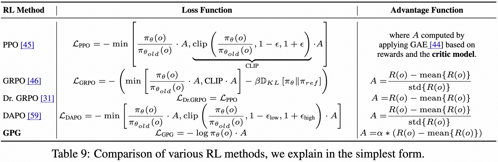

<div align="center">
  <h1 align="center">GPG: A Simple and Strong Reinforcement Learning Baseline for Model Reasoning</h1>
  <div align="center">
        <div class="is-size-5 publication-authors">
              <span class="author-block"> <a href="https://scholar.google.com/citations?user=jn21pUsAAAAJ" target="_blank">Xiangxiang Chu</a>, </span>
              <span class="author-block"> <a href="https://scholar.google.com/citations?user=X0o0Ib8AAAAJ" target="_blank">Hailang Huang</a>, </span>
              <span class="author-block">Xiao Zhang, </span>
              <span class="author-block">Fei Wei, </span>
              <span class="author-block"> <a href="https://www.semanticscholar.org/author/Yong-Wang/1683878" target="_blank">Yong Wang</a></span>
        </div>
        <div class="is-size-5 publication-authors">
              <span class="author-block">AMAP, Alibaba Group</span>
        </div>
    </div>
  📖<a href="https://arxiv.org/abs/2504.02546">Paper</a> | Work in progress.</h3>
</div>
<div>
Reinforcement Learning (RL) can directly enhance the reasoning capabilities of large language models without extensive reliance on Supervised Fine-Tuning (SFT). In this work, we revisit the traditional Policy Gradient (PG) mechanism and propose a minimalist RL approach termed Group Policy Gradient (GPG). Unlike conventional methods, GPG directly optimize the original RL objective, thus obviating the need for surrogate loss functions. As illustrated in the figure below, by eliminating both the critic and reference models, and avoiding KL divergence constraints, our approach significantly simplifies the training process when compared to Group Relative Policy Optimization (GRPO). Our approach achieves superior performance without relying on auxiliary techniques or adjustments. Extensive experiments demonstrate that our method not only reduces computational costs but also consistently outperforms GRPO across various unimodal and multimodal tasks. 
    
</div>


<div align="center">
<h3>Comparison of various RL methods</h2>

</div>

------


# Usage

## Environment Installation

Clone this repository.

```bash
git clone git@github.com:AMAP-ML/GPG.git

cd GPG
```
Follow the repositories you need and install the required packages.

## Experiments on open-rs

Please refer to the training script: [`./open-rs/train.sh`](./open-rs/train.sh), [`./open-rs/recipes`](./open-rs/recipes)


## Experiments on VisualThinker-R1-Zero

Please refer to the training script: [`./VisualThinker-R1-Zero/src/open-r1-multimodal/run_grpo_SAT.sh`](./VisualThinker-R1-Zero/src/open-r1-multimodal/run_grpo_SAT.sh)

The Results are as follows:

> *Table: Results on the DeepSeek-R1istill-Qwen-1.5B model. GPG method achieved an additional average performance boost of 2.6% compared to GRPO.*
> | Models                   | Average   | AIME24 | MATH-500  | AMC23      | Minerva | OlympiadBench |
> |------------------------|:---------:|:------:|:---------:|:----------:|:-------:|:-------------:|
> | Base Model             | 48.9      | 28.8   | 82.8      | 62.9       | 26.5    | 43.3          |
> | + GRPO                 | 53.1      | 33.3   | 83.8      | 67.5       | 29.8    | 50.9          |
> | + GPG                  | 55.7      | 33.3   | 87.6      | 77.5       | 29.4    | 50.5          |


> *Table:  Results on Qwen2.5-Math-7B model. In comparison with GRPO, the GPG method demonstrated superior performance across four distinct datasets.*
> | Models | Average | AIME24 | MATH-500 | AMC23 | Minerva | OlympiadBench |
> |--------------------|:-------:|:------:|:--------:|:-----:|:-------:|:-------------:|
> | Qwen2.5-Math-7B    | 30.9    | 13.3   | 57.6     | 45.0  | 14.7    | 23.7          |
> | + GRPO             | 43.7    | 16.7   | 73.4     | 62.5  | 30.2    | 35.7          |
> | + Dr. GRPO         | 43.7    | 26.7   | 74.6     | 50.0  | 30.1    | 37.3          |
> | + GPG              | 45.3    | 23.3   | 73.6     | 60.0  | 30.5    | 39.3          |


> *Table: Zero-shot pass@1 performance across benchmarks. Dashes (–) denote unavailable official scores. Asterisk (*) indicates reproduced results.*
> | Model                         | Average | AIME24 | MATH-500 | AMC23 | Minerva | OlympiadBench |
> |:-----------------------------:|:-------:|:------:|:--------:|:-----:|:-------:|:-------------:|
> | Llama-3.1-70B-Instruct        | 35.7    | 16.7   | 64.6     | 30.1  | 35.3    | 31.9          |
> | rStar-Math-7B                 | 26.7    | 78.4   | 47.5     | -     | 47.1    | -             |
> | Eurus-2-7B-PRIME              | 26.7    | 79.2   | 57.8     | 38.6  | 42.1    | 48.9          |
> | DeepSeek-R1-Distill-Qwen-1.5B | 48.9    | 28.8   | 82.8     | 62.9  | 26.5    | 43.3          |
> | Still-3-1.5B-Preview          | 51.6    | 32.5   | 84.4     | 66.7  | 29.0    | 45.4          |
> | Open-RS1 \*                   | 53.1    | 33.3   | 83.8     | 67.5  | 29.8    | 50.9          |
> | Open-RS3 \*                   | 52.0    | 26.7   | 85.4     | 70.0  | 27.9    | 50.2          |
> | GPG-RS1                       | 55.7    | 33.3   | 87.6     | 77.5  | 29.4    | 50.5          |
> | GPG-RS3                       | 55.5    | 33.3   | 85.0     | 80.0  | 26.8    | 52.4          |


## Experiments on Visual-RFT

Please refer to the training script: [`./Visual-RFT/src/scripts/`](./Visual-RFT/src/scripts/)


## Experiments on R1-V

Please refer to the training script: [`./R1-V/src/scripts/run_grpo_GEOQA_qwen2.5_3b.sh`](./R1-V/src/scripts/run_grpo_GEOQA_qwen2.5_3b.sh)


## Q&A
If you have any questions, please submit an [issue](https://github.com/AMAP-ML/GPG/issues/new) or contact huanghailang.hhl\<AT\>alibaba-inc.com.


# Citation

If you find GPG or code useful, please cite

```bibtex
@misc{chu2025GPG,
      title={GPG: A Simple and Strong Reinforcement Learning Baseline for Model Reasoning}, 
      author={Xiangxiang Chu and Hailang Huang and Xiao Zhang and Fei Wei and Yong Wang},
      year={2025},
      eprint={2504.02546},
      archivePrefix={arXiv},
      primaryClass={cs.LG},
      url={https://arxiv.org/abs/2504.02546}, 
}
```

## Acknowledgement
We sincerely thank projects <a href="https://github.com/knoveleng/open-rs">open-rs</a>, <a href="https://github.com/turningpoint-ai/VisualThinker-R1-Zero">VisualThinker-R1-Zero</a>, <a href="https://github.com/Liuziyu77/Visual-RFT">Visual-RFT</a>, <a href="https://github.com/Deep-Agent/R1-V">R1-V</a>, <a href="https://github.com/huggingface/open-r1">Open-R1</a>, and <a href="https://github.com/EvolvingLMMs-Lab/open-r1-multimodal">Open-r1-multimodal</a> for providing their open-source resources.